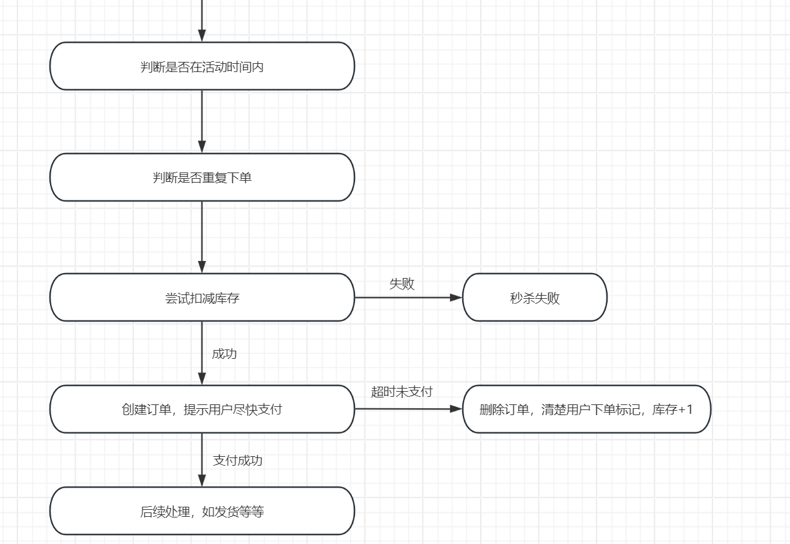

# 秒杀系统的demo

## 数据库设计
这里只针对秒杀系统建表。主要有三个表。 结构如下 

1. **商品表goods(这里的商品是只参与秒杀的商品)**

2. **用户表user**

3. **订单表order**

## 秒杀商品的规则
每个用户对一件商品最多买一件，即不可重复下单
## 秒杀的流程图

## 涉及的技术
### Mysql
主要是对数据库的增删改查

### Redis
用于 秒杀商品的缓存预热处理、库存的增减(需要保证原子性，一致性)

### MQ
MQ主要用于异步下单 和 订单的延时支付处理。

## 在写这个demo时遇到的问题
### 多线程涉及到的问题

Q : 当同一用户多台设备一起同时下单，那么很有可能同时访问缓存查看是否已经下过单，这样的话每个线程都会得到没下过单的结果，然后都去下单，就会冲突。 
A : 锁住 创建订单 这一步骤，使得一个时间段只有一个线程到达这一步骤，然后判断是否数据库是否已经下单了，无则创建订单并插入。

Q : redis插入值时键前面带一堆 16进制数
A : redistemplate没有序列化，配置一下就好

Q : 扣减库存 和创建订单是原子操作，如何保证？
A :